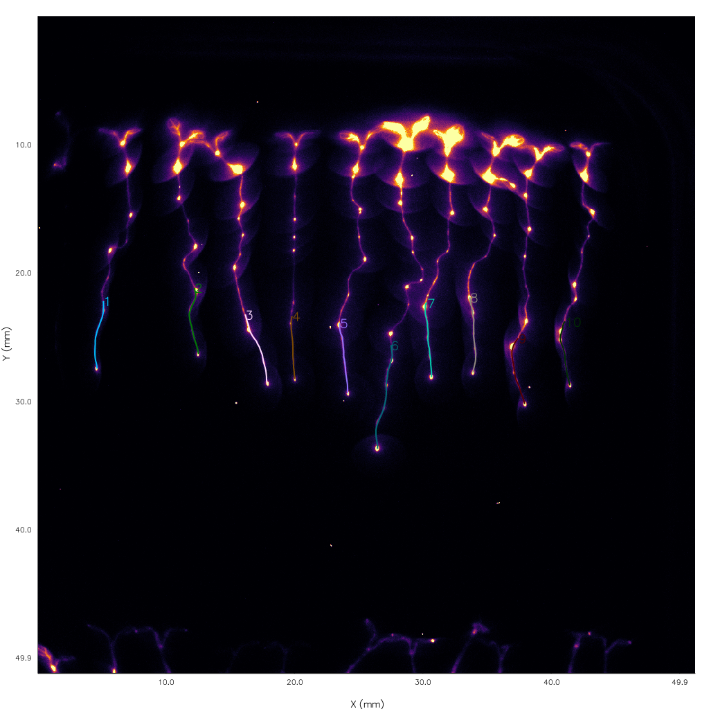

# TrackRoots
This is a `Julia` script for analysing light intensities as a function of time and space in time-lapse image stacks of seedling roots.

| Windows | macOS | Coverage |
| --- | --- | --- |
| [](https://ci.appveyor.com/project/yakir12/trackroots-jl/branch/master) | [](https://travis-ci.org/yakir12/TrackRoots.jl) | [](https://coveralls.io/github/yakir12/TrackRoots.jl?branch=master) |


## How to install
1. If you haven't already, install the current release of [Julia](https://julialang.org/downloads/) -> you should be able to launch it (some icon on the Desktop or some such).
2. Start Julia -> a Julia-terminal popped up.
3. Copy: 
   ```julia
   Pkg.clone("https://github.com/yakir12/TrackRoots.jl")
   Pkg.build("TrackRoots")
   ```
   and paste it in the newly opened Julia-terminal, press Enter -> this may take a long time.
4. (*not necessary*) To test the package, copy: 
   ```julia
   Pkg.test("TrackRoots")
   ```
   and paste it in the Julia-terminal. Press enter to check if all the tests pass -> this may also take a long time (all tests should pass).
5. You can close the Julia-terminal after it's done running.

**Note:** If you are on `macOS` you might need to install `cairo` and `ffmpeg`:
```
brew install cairo ffmpeg
```

## Quick start
1. Start Julia -> a Julia-terminal popped up.
2. Copy and paste this in the newly opened Julia-terminal: 
   ```julia
   using TrackRoots
   main()
   ``` 
   You will be asked to navigate to the `.nd` file you want to analyse and select the root tips of the first frame for each of the stages. 
   
**Note:** The first time this is executed will be significantly slower than all subsequent runs. While this is annoying, one simple remedy is to simply keep this terminal open and rerun `main()` every time you need to analyse another dataset.

Click to see a tutorial video on how to use the program:

<a href="https://vimeo.com/258615822" target="_blank"></a>

## Detailed instructions
1. The analysis is performed per `.nd` file. These files contain all the information needed to process the dark and bright 16-bit TIF images for all stages. 
2. After choosing the `.nd` file, you'll be presented with a composite image of the first stage. In order to help with identifying the correct root tip, this image shows you a composite of the first (magenta colored) and last (green colored) frames of the time-lapse. You can use the sliders at the bottom of the window to adjust the exposure of the first and last frames. To select a root tip `Shift-click` on the tip of a (magenta colored) root you want to include in your analysis. A blue dot will appear where you've clicked. To unselect press `Shift-Crtl-click` in the vicinity of the spot/s you want to remove. The closest spots will disappear.

   To facilitate identification use the zoom: `Ctrl-click` and drag somewhere inside the image. You'll see the typical rubberband selection, and once you let go the image display will zoom in on the selected region. If you click on the image without holding down `Ctrl`, you can drag the image to look at nearby regions. `Ctrl-double-click` on the image to restore the full region. If you have a wheel mouse, zoom in again and scroll the wheel, which should cause the image to pan vertically. If you scroll while holding down `Shift`, it pans horizontally; hold down `Ctrl` and you affect the zoom setting.

   To help you identify what constitutes a root-tip in the first frame, watch [this video](https://vimeo.com/258952278) show-casing the process for 21 root-tips.
3. Close the window when you're done selecting root tips. This process will repeat for all the stages in that dataset. To skip a stage simply close the window without selecting any root tips.
4. Once you've finished selecting root tips in all of the stages, the program will automatically calibrate all the images, track all the roots, and save the results (notifying you of its progress in each step). 
5. You can close the Julia-terminal after it's done running (or keep it open to save time in the next run).

## Results
The results from each `.nd` file will be saved in a folder named the same as the `.nd` file. That results folder will contain one folder per stage. Each of those stage folders will contain one `roots.png` image showing which roots got tracked and their corresponding ID number:



The stage folder will also contain one folder per root. Each of the root folders will contain three files:
1. `coordinates.csv`: a comma separated file with the `[x, y]` coordinates of the tips of the root (in mm) as a function of time (as it grew).
2. `intensities.csv`: a comma separated file with the lengths in mm, times in hours, and intensities. The first column is the root lengths (i.e. the distance along the root between the starting location of the tip and its current location), the second column is the intensities at time 0 hours, the third column is the intensities at the next period, etc. 
4. `summary.mp4`: a summary video showing these changes as a function of time:
    1. an image of the progression of the root and its track (`x` and `y` axis are in mm).
    2. a heat-map describing the intensity of the root tip as a function of time in hours and root length in mm (i.e. the distance along the root between the starting location of the tip and its current location).
    3. a plot of the intensity as a function of root length in mm.
    4. a plot of the intensity as a function of time in hours.


The resulting file hierarchy will look like this:
```
folder
│   dataset_1.nd
│   dataset_1_w1[None]_s1_t1.TIF
│   dataset_1_w1[None]_s1_t2.TIF
│   dataset_1_w1[None]_s1_t3.TIF
│   …
│
└───dataset_1
    │   
    ├───satge_1
    │   │   roots.png
    │   │
    │   ├───root 1
    │   │      coordinates.csv
    │   │      intensities.csv
    │   │      summary.mp4
    │   │
    │   └───root 2
    │   …
    │  
    └───satge_2
    …

```

## Batch process
In case you want to process a bunch of `.nd` files, it is easier to first select the root tips of *all* the datasets and process the results after. This way, the manual part of the job will be done first, leaving the rest of the processing to the computer (go drink a cup of tea). To do exactly that use the `batch_main()` function. It will ask you to point to the folder that contains all the `.nd` files you want to process, automatically find them all and report how many it found, ask you to select the root tips of the first frames for each of the stages in each of the datasets, and finally process the results while showing you its progress.

## How to update
To update your local version of `TrackRoots`, copy-paste this in a Julia-terminal: 
```julia
Pkg.update()
``` 

**Note:** After an update, the next time you run `TrackRoots` (almost any Julia script really) will be slower than usual. However, all subsequent runs will be fast.

## How does it all work?
The structure of the `.nd` file is translated into a type system for efficient and secure handling of the data. This procedure should be able to handle any combination of stages/wavelengths. The root-tip points are selected via a `Gtk` library. The spatial calibration works by automatically detecting the grid-lines in the bright images using a Hough transform. The limitation of this process is that at least two clear unobstructed grid-lines should be visible in one of the bright images. The temporal calibration works by extracting the original modification/creation times of the image files using `exiftools`. The advantage of this method is that you can safely run it on copied images (i.e. not the original files) and it will still work. Tracking the roots works via a Kalman filter which auto corrects its estimates from image-feedback. This leads to a robust and accurate root trajectory. Finally, saving the results is done by creating an informative mp4 and data files.
